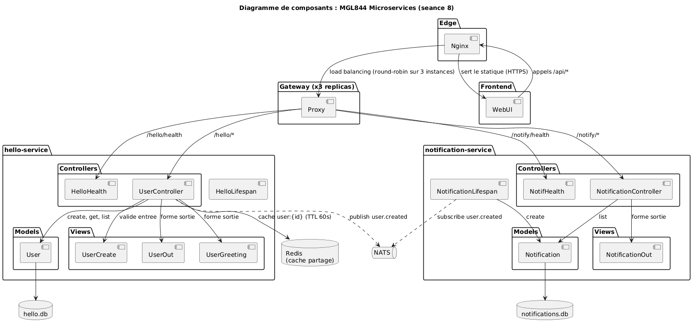
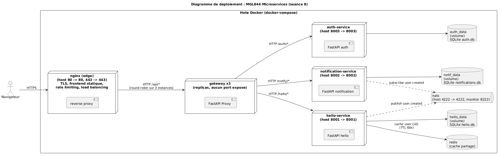

# MGL844 : Lab Microservices

[](https://github.com/olry/MGL844-Demo-Microservices/actions/workflows/publish.yml)

Projet de départ pour le cours. Il contient une porte d'entrée **nginx**
(reverse proxy), un *gateway* applicatif mis à l'échelle en **3 instances**,
deux services exemples (`hello-service` qui publie un événement,
`notification-service` qui le consomme), [NATS](https://docs.nats.io/)
(un broker de messages), [Redis](https://redis.io/) (un cache partagé)
et une petite interface web pour tester les endpoints.

## Architecture





Depuis la séance 8, **nginx** est la seule porte exposée. Il termine le TLS
(HTTPS), sert le frontend statique, limite le débit (rate limiting) et
**répartit la charge** (load balancing) sur les 3 instances du `gateway`.
Le `gateway` reste le routeur applicatif : il transfère vers `hello-service`
ou `notification-service` selon le préfixe d'URL.
`hello-service` publie l'événement `user.created` sur NATS,
`notification-service` y est abonné et stocke chaque message reçu ;
`hello-service` met aussi en cache ses lectures dans Redis.
Les autres diagrammes (cas d'usage, séquence, classes, déploiement)
sont dans `doc/`.

Technos : [FastAPI](https://fastapi.tiangolo.com/),
[SQLAlchemy 2.0 async](https://docs.sqlalchemy.org/en/20/orm/extensions/asyncio.html),
[Pydantic](https://docs.pydantic.dev/),
[nats-py](https://nats-io.github.io/nats.py/),
[Docker Compose](https://docs.docker.com/compose/),
[pytest](https://docs.pytest.org/).


## Démarrage rapide

Une seule chose requise : **[Docker Desktop](https://www.docker.com/products/docker-desktop/)** installé et lancé.

**Windows (PowerShell)**
```
copy .env.example .env
docker compose up -d --build
```

**macOS / Linux**
```
cp .env.example .env
docker compose up -d --build
```

Attendre 15 secondes, puis ouvrir **<https://localhost>** dans le navigateur.

> Le navigateur affiche un **avertissement de sécurité** : le certificat TLS
> est auto-signé (généré automatiquement au démarrage par le conteneur
> `cert-init`). C'est normal en labo, on clique « Avancé » puis « Continuer ».

C'est tout. L'interface web permet de tester chaque endpoint, et le premier
bloc montre le **load balancing** en direct sur les 3 gateways.

Pour tout arrêter :
```
docker compose down
```
Pour tout arrêter ET vider les bases de données :
```
docker compose down -v
```


## Lancer sans cloner le repo (images depuis GHCR)

> **Depuis la séance 8**, nginx monte des fichiers locaux (`nginx/nginx.conf`
> et le dossier `frontend/`). La méthode « deux fichiers seulement » ne suffit
> donc plus : le plus simple est désormais de **cloner le repo** puis de suivre
> le *Démarrage rapide*. La procédure ci-dessous reste valable si tu récupères
> aussi le dossier `nginx/` et le dossier `frontend/`.

Si tu veux juste essayer l'application sans télécharger tout le code source,
il te faut `docker-compose.yml`, `.env`, le dossier `nginx/` et le dossier
`frontend/`. Les images des services sont déjà publiées sur **GitHub Container
Registry** à chaque push sur `main`.

**Étape 1 : créer un dossier vide pour le projet**

**Windows (PowerShell)**
```powershell
mkdir mgl844-demo
cd mgl844-demo
```

**macOS / Linux**
```bash
mkdir mgl844-demo
cd mgl844-demo
```

**Étape 2 : télécharger les deux fichiers**

**Windows (PowerShell)**
```powershell
curl.exe -O https://raw.githubusercontent.com/olry/MGL844-Demo-Microservices/main/docker-compose.yml
curl.exe -O https://raw.githubusercontent.com/olry/MGL844-Demo-Microservices/main/.env.example
copy .env.example .env
```

**macOS / Linux**
```bash
curl -O https://raw.githubusercontent.com/olry/MGL844-Demo-Microservices/main/docker-compose.yml
curl -O https://raw.githubusercontent.com/olry/MGL844-Demo-Microservices/main/.env.example
cp .env.example .env
```

**Étape 3 : tirer les images puis démarrer**

```
docker compose pull
docker compose up -d
```

Attendre 15 secondes puis ouvrir <https://localhost>.

**Pour arrêter** :
```
docker compose down
```

**Pour arrêter ET vider les bases de données** :
```
docker compose down -v
```

**Pour mettre à jour vers la dernière version publiée** :
```
docker compose pull
docker compose up -d
```

Images disponibles (toutes en `:latest` et `:sha-XXXXXXX`) :

* `ghcr.io/olry/mgl844-demo-microservices/gateway`
* `ghcr.io/olry/mgl844-demo-microservices/hello-service`
* `ghcr.io/olry/mgl844-demo-microservices/notification-service`
* `ghcr.io/olry/mgl844-demo-microservices/frontend`

> **Pourquoi ça marche sans le code source ?**
> Le fichier `docker-compose.yml` contient deux infos pour chaque service :
> `image:` (où aller chercher l'image sur GHCR) et `build:` (comment la
> builder localement). `docker compose pull` lit seulement `image:` et tire
> depuis GHCR. Comme les images existent ensuite en local, `docker compose
> up` ne touche jamais à `build:`, donc pas besoin des dossiers `backend/`
> et `frontend/`.


## URLs utiles

Depuis la séance 8, tout passe par **nginx** en HTTPS. La gateway n'est plus
exposée directement : on l'atteint uniquement via `https://localhost/api/...`.
Les services restent exposés en direct (ports 8001-8003) pour le débogage et
Swagger.

| Service | URL |
|---------|-----|
| **Interface web** | **<https://localhost>** |
| API (via nginx, load-balancée) | <https://localhost/api/> |
| Quelle gateway répond ? | <https://localhost/api/whoami> |
| hello-service direct | <http://localhost:8001> |
| notification-service direct | <http://localhost:8002> |
| Swagger UI (hello) | <http://localhost:8001/docs> |
| Swagger UI (notify) | <http://localhost:8002/docs> |
| NATS monitoring | <http://localhost:8222> |


## Démo séance 8 (Nginx : load balancing, cache, rate limiting, TLS)

Stack démarrée, ces commandes prouvent chaque rôle de nginx (Windows :
`curl.exe` ; ajouter `-k` car le certificat est auto-signé).

```bash
# 1. LOAD BALANCING : le nom de gateway change à chaque appel (round-robin).
for i in 1 2 3 4 5 6; do curl -sk https://localhost/api/whoami; echo; done

# 2. FRONTEND STATIQUE servi par nginx + TLS actif.
curl -skv https://localhost/ 2>&1 | grep -i "SSL connection"

# 3. CACHE REDIS : 1er appel cache_miss, suivants cache_hit.
curl -sk -X POST https://localhost/api/hello/users -H "Content-Type: application/json" -d '{"name":"Alice"}'
curl -sk https://localhost/api/hello/users/1   # cache_miss
curl -sk https://localhost/api/hello/users/1   # cache_hit
docker compose logs hello-service | grep -E "cache_(hit|miss)"

# 4. RATE LIMITING : en parallèle, au-delà de 5 req/s on reçoit des 429.
seq 60 | xargs -P 20 -I{} curl -sk -o /dev/null -w "%{http_code}\n" \
  -X POST https://localhost/api/auth/auth/login \
  -H "Content-Type: application/json" -d '{"username":"x","password":"y"}' \
  | sort | uniq -c
```

> Voir le load balancing côté nginx : `docker compose logs nginx | grep gateway`
> montre l'adresse de l'instance choisie `[gateway 172.x.x.x:8000]`, qui alterne.


## Tester les endpoints

Deux façons :

**Option A : interface web** sur <http://localhost:3000> (bouton par endpoint).

**Option B : Swagger UI** généré automatiquement par FastAPI pour chaque service.
Tu vois la liste des routes, tu cliques "Try it out", tu remplis le corps,
tu cliques "Execute".

| Service              | Swagger UI                          |
|----------------------|-------------------------------------|
| hello-service        | <http://localhost:8001/docs>        |
| notification-service | <http://localhost:8002/docs>        |

Parcours typique pour voir l'événement NATS en action :

1. Sur Swagger hello : `POST /users` avec `{"name": "Alice"}`. Réponse 201.
2. Sur Swagger notify : `GET /notifications`. La liste contient
   `Bonjour Alice ! (id=1)` (publié par hello sur NATS, consommé par notify).


## Lancer les tests

Créer un environnement Python local (une seule fois) :

**Windows**
```
py -m venv .venv
.venv\Scripts\pip install -r backend\requirements.txt
```

**macOS / Linux**
```
python3 -m venv .venv
.venv/bin/pip install -r backend/requirements.txt
```

Les tests sont rangés sous `backend/tests/` :

* `backend/tests/unit/` : tests unitaires (aucun conteneur requis).
* `backend/tests/integration/` : tests d'intégration (les conteneurs doivent tourner, voir le démarrage rapide).

Tout lancer :
```
.venv\Scripts\python -m pytest backend -v
```
(macOS / Linux : `.venv/bin/python -m pytest backend -v`)

Pour ne lancer qu'un seul groupe : remplacer `backend` par `backend/tests/unit` ou `backend/tests/integration`.

Le rapport de couverture s'affiche automatiquement après les tests unitaires.


## Dépannage

| Erreur | Cause | Solution |
|--------|-------|----------|
| `error while interpolating ... must be set in .env` | pas de fichier `.env` | refaire `copy .env.example .env` (Windows) ou `cp .env.example .env` (macOS/Linux) |
| `Bind for 0.0.0.0:443 failed` (ou `:80`) | port 80/443 déjà pris (IIS, Skype, autre nginx) | libérer le port, ou changer le mapping `ports:` du service `nginx` dans `docker-compose.yml` |
| Avertissement de certificat dans le navigateur | certificat TLS auto-signe (normal en labo) | cliquer « Avancé » puis « Continuer vers localhost » |
| `nats` reste `unhealthy` | port 4222 déjà pris | redémarrer Docker Desktop, vérifier qu'aucun autre NATS ne tourne |
| Le load balancing ne tourne pas (toujours la même gateway) | une seule instance démarrée | vérifier `docker compose ps` : il doit y avoir `gateway-1`, `gateway-2`, `gateway-3` |
| L'interface web n'affiche rien | conteneurs pas encore prêts | attendre 15 s, puis `docker compose ps` (tout doit être `healthy`) |
